# Jnkn

**The Pre-Flight Impact Analysis Engine for Engineering Teams.**

Jnkn prevents production outages by stitching together the hidden dependencies between your **Infrastructure** (Terraform), **Data Pipelines** (dbt), and **Application Code**.

---

## The Problem

Most tools operate in silos:

| Tool | What It Checks | Blind Spot |
|------|----------------|------------|
| **Infracost** | Terraform cost | Doesn't know what code uses those resources |
| **dbt** | SQL lineage | Doesn't know what services query those tables |
| **Turborepo** | Code monorepos | Doesn't know what infra the code depends on |
| **Dependabot** | Package versions | Doesn't know infrastructure compatibility |
| **Terraform Plan** | Resource changes | Doesn't know what env vars code expects |

**Jnkn checks the "Glue."** It detects cross-domain breaking changes that slip through every other tool.

It does so like this:

```mermaid
graph TB
    subgraph Code["Application Code"]
        PY[Python Services]
        JS[Node.js APIs]
    end
    
    subgraph Infra["Infrastructure"]
        TF[Terraform Resources]
        K8S[Kubernetes Manifests]
    end
    
    subgraph Data["Data Pipelines"]
        DBT[dbt Models]
        SQL[SQL Tables]
    end
    
    PY -->|os.getenv| ENV[ENV VARS]
    ENV -->|provides| TF
    DBT -->|ref| SQL
    PY -->|queries| SQL
    TF -->|provisions| SQL
    
    ENV -.->|"❌ Rename breaks app"| PY
    SQL -.->|"❌ Schema change breaks API"| JS
    TF -.->|"❌ Delete breaks worker"| PY
    
    style ENV fill:#ff6b6b,stroke:#c92a2a,color:#fff
```



### The Breaking Changes That Cause 3am Pages

```mermaid
graph LR
    subgraph "Infra → Code"
        TF1[Terraform PR] -->|renames| ENV1[DB_HOST → DATABASE_HOST]
        ENV1 -->|"💥"| APP1[Python app crashes]
    end
```



> **Infra → Code:** A Terraform PR renames an environment variable `DB_HOST` to `DATABASE_HOST`, silently causing your Python application to crash on startup.

---



```mermaid
graph LR
    subgraph "Infra → Data"
        TF2[Terraform change] -->|rotates| IAM[S3 IAM Role]
        IAM -->|revokes s3:GetObject| DBT1[dbt model]
        DBT1 -->|"💥"| ETL[Nightly ETL fails]
    end
```

> **Infra → Data:** A Terraform change rotates the IAM role for an S3 bucket, inadvertently revoking the `s3:GetObject` permission used by a dbt model to load raw CSVs, causing the nightly ETL to fail.

---



```mermaid
graph LR
    subgraph "Data → Code"
        DBT2[dbt schema change] -->|renames| COL[user_id → customer_id]
        COL -->|breaks| API[Order History API]
        API -->|"💥"| ERR[500 errors]
    end
```

> **Data → Code:** A dbt model schema change renames the `user_id` column to `customer_id` in the `fct_orders` table, but the Python backend service that queries this table for the "Order History" API endpoint wasn't updated, leading to 500 errors.

---



```mermaid
graph LR
    subgraph "Code → Infra"
        DEV[Developer updates] -->|changes| K8S1[Redis image to v7]
        K8S1 -->|incompatible with| TF3[ElastiCache param group]
        TF3 -->|"💥"| CRASH[Service won't stabilize]
    end
```

> **Code → Infra:** A developer updates the `docker-compose.yml` or Kubernetes manifest to use a new Redis image version (e.g., v7), but the Terraform state still provisions an older AWS ElastiCache parameter group incompatible with v7, preventing the service from stabilizing.

---



```mermaid
graph LR
    subgraph "Data → Infra"
        DBT3[dbt model change] -->|causes| SIZE[Table 3x size]
        SIZE -->|exceeds| IOPS[RDS IOPS limit]
        IOPS -->|"💥"| LAT[Severe latency]
    end
```

> **Data → Infra:** A new dbt model logic change causes a table to triple in size overnight, exceeding the allocated storage IOPS defined in the Terraform configuration for the RDS instance, leading to severe latency.

---



```mermaid
graph LR
    subgraph "Infra → Code"
        TF4[Terraform PR] -->|deletes| SQS[Deprecated SQS queue]
        SQS -->|hardcoded in| WORKER[Background worker]
        WORKER -->|"💥"| LOOP[Crash loop]
    end
```

> **Infra → Code:** A Terraform PR deletes a deprecated SQS queue, but a legacy Python background worker still has a hardcoded reference to that queue URL in its settings, causing the worker to crash loop on startup.

---

## How Jnkn Solves This

Jnkn builds a **unified dependency graph** across all domains:

```mermaid
flowchart LR
    subgraph Parse["1. Parse"]
        PY2[".py files"]
        TF5[".tf files"]
        DBT4["dbt manifest"]
    end
    
    subgraph Build["2. Build Graph"]
        NODES[("Nodes:\n- env:DB_HOST\n- infra:rds.main\n- file:app.py")]
    end
    
    subgraph Stitch["3. Stitch"]
        MATCH["Token Matching:\nDB_HOST ↔ db_host"]
    end
    
    subgraph Query["4. Query"]
        BLAST["Blast Radius:\nWhat breaks if X changes?"]
    end
    
    Parse --> Build --> Stitch --> Query
    
    style Stitch fill:#4dabf7,stroke:#1971c2,color:#fff
```



**The key innovation is Step 3: Stitching.** Jnkn uses token-based fuzzy matching to discover implicit dependencies:


---

## Installation

### Prerequisites

- **Python 3.11+**
- **[uv](https://github.com/astral-sh/uv)** (recommended) or pip

### Install with uv

```bash
git clone https://github.com/your-org/jnkn.git
cd jnkn
uv sync
uv run jnkn --help
```

### Install with pip

```bash
git clone https://github.com/your-org/jnkn.git
cd jnkn
pip install -e .
jnkn --help
```

---

## Quick Start

### 1. Scan Your Codebase

```bash
# Scan current directory
uv run jnkn scan --dir .

# Scan specific directory with lower confidence threshold
uv run jnkn scan --dir ./src --min-confidence 0.3
```

**Output:**
```
🚀 Scanning /path/to/project ...
📁 Found 47 files to scan (12 unchanged, 203 unsupported)
✅ Parsed 156 nodes and 89 edges.
🧵 Stitching cross-domain dependencies...
✅ Created 8 cross-domain links.
   • EnvVarToInfraRule: 6
   • InfraToInfraRule: 2
✅ Scan Complete.
```

### 2. Calculate Blast Radius

```bash
# What breaks if this env var changes?
uv run jnkn blast env:DATABASE_URL

# What's impacted by this Terraform resource?
uv run jnkn blast infra:payment_db_host
```

**Output:**
```json
{
  "source_artifacts": ["env:DATABASE_URL"],
  "total_impacted_count": 5,
  "impacted_artifacts": [
    "infra:aws_db_instance.main",
    "file://src/db/connection.py",
    "file://src/api/users.py"
  ],
  "breakdown": {
    "infra": ["infra:aws_db_instance.main"],
    "code": ["file://src/db/connection.py", "file://src/api/users.py"],
    "env": [],
    "data": [],
    "unknown": []
  }
}
```

### 3. View Statistics

```bash
uv run jnkn stats
```

```
📊 Graph Statistics
========================================
Schema Version:  2
Total Nodes:     156
Total Edges:     97
Tracked Files:   47
DB Size:         124.5 KB

Nodes by Type:
  code_file: 42
  env_var: 12
  infra_resource: 8

Edges by Type:
  imports: 67
  reads: 18
  provides: 8
```

---

## CLI Reference

| Command | Description |
|---------|-------------|
| `jnkn scan` | Parse codebase and build dependency graph |
| `jnkn blast <artifact>` | Calculate downstream impact |
| `jnkn stats` | Show graph statistics |
| `jnkn clear` | Clear all data |

### `jnkn scan` Options

| Option | Default | Description |
|--------|---------|-------------|
| `--dir` | `.` | Root directory to scan |
| `--db` | `.jnkn/jnkn.db` | Path to SQLite database |
| `--full` | `false` | Force full rescan |
| `--min-confidence` | `0.5` | Minimum confidence for stitched links |

### `jnkn blast-radius` Options

| Option | Default | Description |
|--------|---------|-------------|
| `--db` | `.jnkn/jnkn.db` | Path to SQLite database |
| `--max-depth` | `-1` | Maximum traversal depth |
| `--lazy` | `false` | Use SQL queries (memory-efficient) |

---

## Supported Patterns

### Python Environment Variables

```python
os.getenv("VAR_NAME")           # ✅ Detected
os.environ.get("VAR_NAME")      # ✅ Detected
os.environ["VAR_NAME"]          # ✅ Detected
getenv("VAR_NAME")              # ✅ Detected (after import)
```

### Terraform Resources

```hcl
resource "aws_db_instance" "main" {    # ✅ Detected as infra:main
  ...
}
```

---

## Stitching Strategies

| Strategy | Confidence | Example Match |
|----------|------------|---------------|
| **Normalized** | 0.95 | `DB_HOST` ↔ `db_host` |
| **Token Overlap** | 0.85 | `PAYMENT_DB` ↔ `payment_db_instance` |
| **Suffix** | 0.75 | `DB_HOST` ↔ `aws_rds_db_host` |

Tune sensitivity:

```bash
# More matches (more false positives)
jnkn scan --min-confidence 0.3

# Fewer matches (higher precision)
jnkn scan --min-confidence 0.8
```

---

## CI/CD Integration

### GitHub Actions

```yaml
name: Jnkn Impact Analysis
on:
  pull_request:
    paths: ['**.py', '**.tf']

jobs:
  analyze:
    runs-on: ubuntu-latest
    steps:
      - uses: actions/checkout@v4
      
      - name: Install Jnkn
        run: |
          pip install uv
          git clone https://github.com/your-org/jnkn.git /tmp/jnkn
          cd /tmp/jnkn && uv sync
      
      - name: Analyze Changes
        run: |
          cd /tmp/jnkn
          uv run jnkn scan --dir $GITHUB_WORKSPACE
          
          for file in $(git diff --name-only origin/main...HEAD | grep -E '\.(py|tf)$'); do
            echo "::group::Impact of $file"
            uv run jnkn blast "$file"
            echo "::endgroup::"
          done
```

---

## Architecture


---

## Project Structure

```
jnkn/
├── src/jnkn/
│   ├── cli/main.py              # CLI commands
│   ├── core/
│   │   ├── types.py             # Node, Edge, enums
│   │   ├── graph.py             # DependencyGraph + TokenIndex
│   │   ├── stitching.py         # Cross-domain matching
│   │   └── storage/             # SQLite + Memory adapters
│   ├── languages/
│   │   ├── parser.py            # TreeSitter engine
│   │   ├── python/*.scm         # Python queries
│   │   └── terraform/*.scm      # Terraform queries
│   └── analysis/
│       └── blast_radius.py      # Impact analysis
├── scripts/verify_e2e.sh        # E2E test
└── pyproject.toml
```

---

## Roadmap

- [ ] dbt manifest.json parsing
- [ ] Terraform plan JSON parsing  
- [ ] Kubernetes manifest parsing
- [ ] GitHub PR comments with impact summary
- [ ] Graph visualization (Mermaid/DOT export)
- [ ] VS Code extension
- [ ] Multi-repo support

---

## Development

```bash
# Run E2E test
bash scripts/verify_e2e.sh

# Run unit tests
uv run pytest
```

---

## License

MIT

---

## Contributing

1. Fork the repository
2. Create a feature branch
3. Make changes in `src/jnkn/`
4. Run tests
5. Submit a pull request
