# jnkn Architecture

> **Version:** 0.4.0  
> **Last Updated:** December 2024

This document provides a comprehensive technical overview of jnkn's architecture, including system design, data flows, module responsibilities, and extension points.

---

## Table of Contents

1. [System Overview](#system-overview)
2. [High-Level Architecture](#high-level-architecture)
3. [Core Concepts](#core-concepts)
4. [Module Architecture](#module-architecture)
5. [Data Flow](#data-flow)
6. [Parser System](#parser-system)
7. [Stitching Engine](#stitching-engine)
8. [Storage Layer](#storage-layer)
9. [Analysis Engine](#analysis-engine)
10. [CLI Layer](#cli-layer)
11. [Extension Points](#extension-points)
12. [Directory Structure](#directory-structure)

---

## System Overview

jnkn is a **cross-domain dependency analysis engine** that discovers hidden relationships between infrastructure (Terraform), data pipelines (dbt), and application code (Python, JavaScript, Kubernetes).

### The Problem jnkn Solves

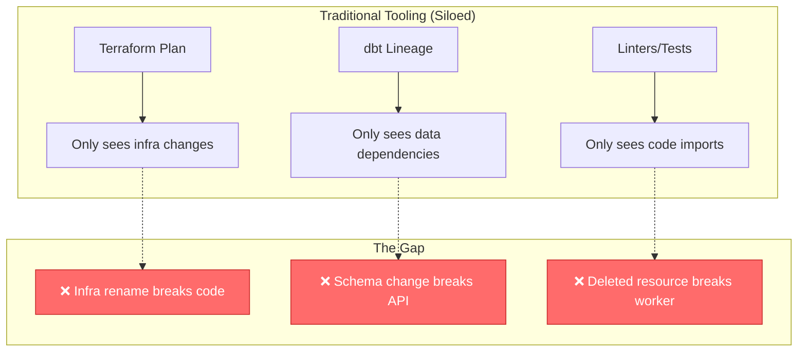

### jnkn's Solution

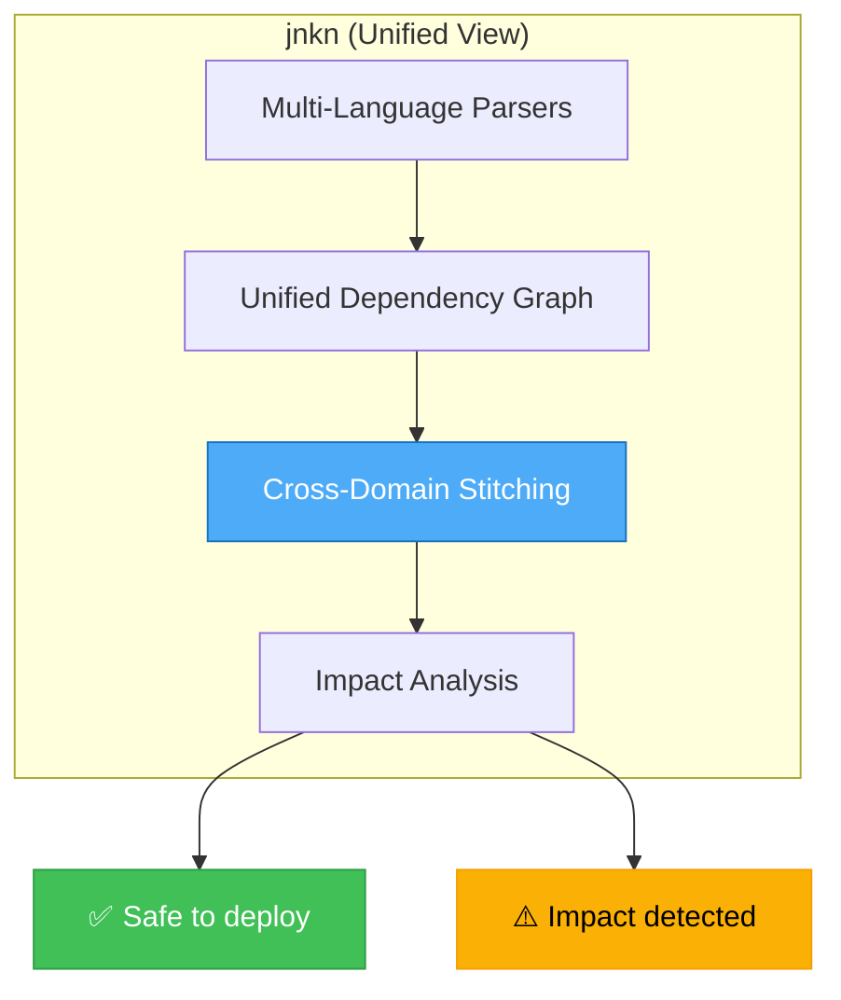

---

## High-Level Architecture

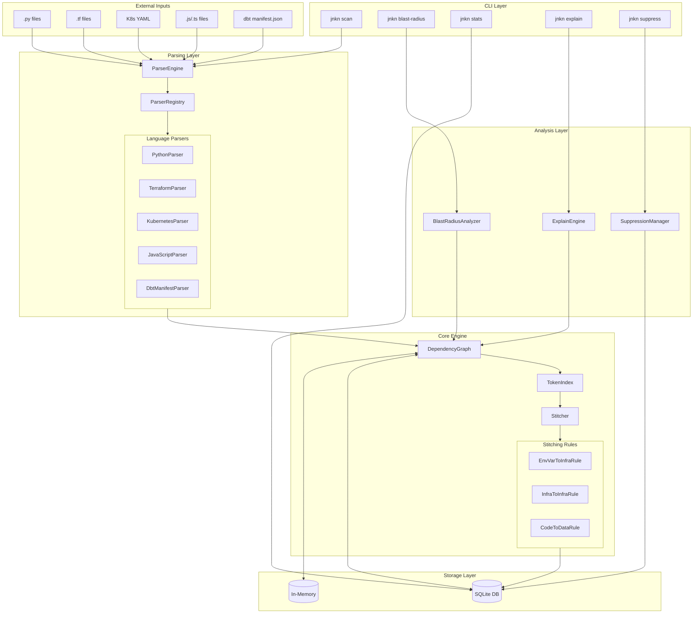

---

## Core Concepts

### Node Types

Nodes represent entities in the dependency graph:

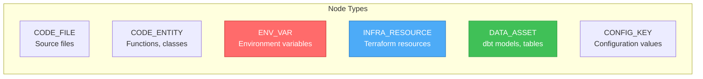

### Relationship Types

Edges represent directed relationships between nodes:

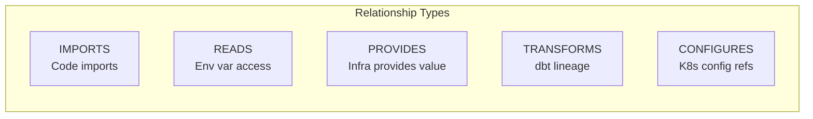

### Node and Edge Data Model

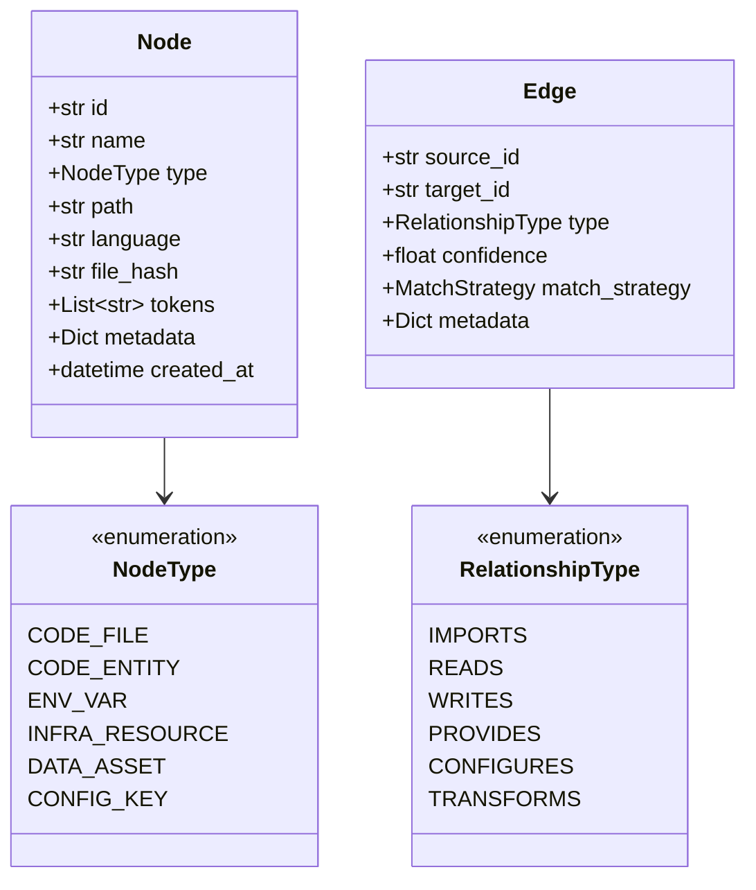

---

## Module Architecture

### Package Structure

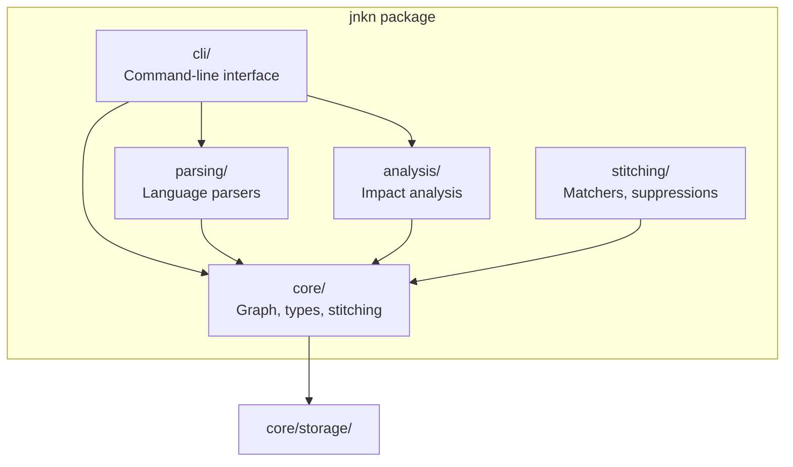

### Module Responsibilities

| Module | Responsibility |
|--------|----------------|
| `core/types.py` | Data models (Node, Edge, enums) |
| `core/graph.py` | DependencyGraph and TokenIndex |
| `core/stitching.py` | Cross-domain link discovery |
| `core/storage/` | SQLite and in-memory backends |
| `parsing/base.py` | Parser base classes and interfaces |
| `parsing/engine.py` | Parser orchestration and registry |
| `parsing/python/` | Python source parser |
| `parsing/terraform/` | Terraform HCL parser |
| `parsing/kubernetes/` | K8s YAML parser |
| `parsing/javascript/` | JS/TS parser |
| `parsing/dbt/` | dbt manifest parser |
| `analysis/blast_radius.py` | Impact calculation |
| `analysis/explain.py` | Match explanation |
| `stitching/matchers.py` | Token matching utilities |
| `stitching/suppressions.py` | False positive management |
| `cli/main.py` | CLI commands |

---

## Data Flow

### Scan Flow

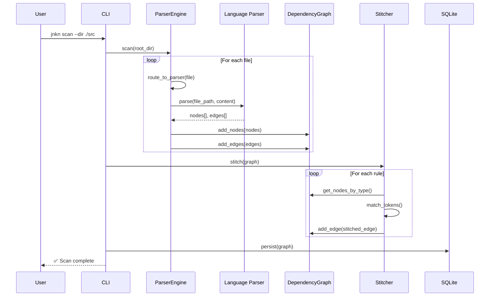

### Blast Radius Flow

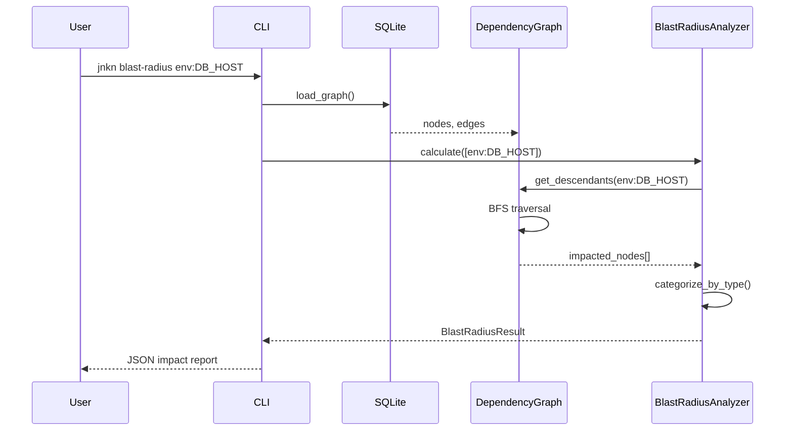

---

## Parser System

### Parser Class Hierarchy

```mermaid
classDiagram
    class LanguageParser {
        <<abstract>>
        +name: str
        +extensions: Set~str~
        +context: ParserContext
        +parse(path, content)*
        +get_capabilities()
        +parse_file(path)
    }
    
    class PythonParser {
        +name = "python"
        +extensions = {".py", ".pyi"}
        -_parse_with_tree_sitter()
        -_parse_with_regex()
        -_extract_env_vars()
        -_extract_imports()
    }
    
    class TerraformParser {
        +name = "terraform"
        +extensions = {".tf"}
        -_extract_resources()
        -_extract_variables()
        -_extract_outputs()
    }
    
    class KubernetesParser {
        +name = "kubernetes"
        +extensions = {".yaml", ".yml"}
        -_extract_workloads()
        -_extract_env_vars()
        -_extract_config_refs()
    }
    
    class JavaScriptParser {
        +name = "javascript"
        +extensions = {".js", ".ts", ".jsx", ".tsx"}
        -_extract_process_env()
        -_extract_imports()
    }
    
    class DbtManifestParser {
        +name = "dbt_manifest"
        +extensions = {".json"}
        -_extract_models()
        -_extract_sources()
        -_extract_lineage()
    }
    
    LanguageParser <|-- PythonParser
    LanguageParser <|-- TerraformParser
    LanguageParser <|-- KubernetesParser
    LanguageParser <|-- JavaScriptParser
    LanguageParser <|-- DbtManifestParser
```

### Parser Engine Architecture

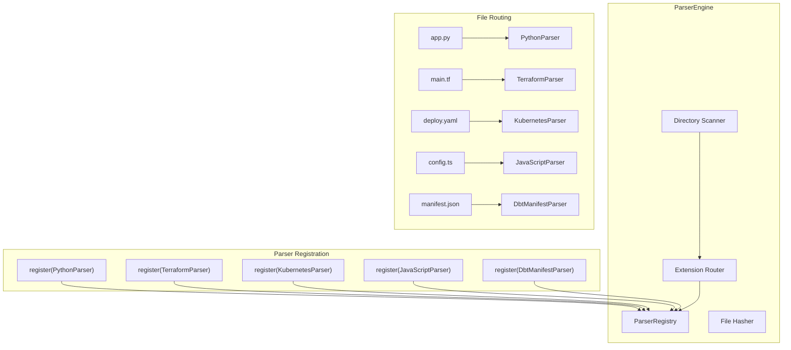

### Python Parser - Env Var Detection Patterns

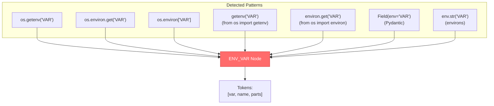

---

## Stitching Engine

The stitching engine is jnkn's **core innovation** - it discovers implicit dependencies across domains.

### Stitching Process

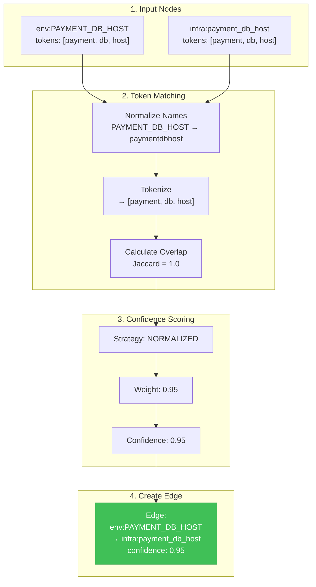

### Matching Strategies

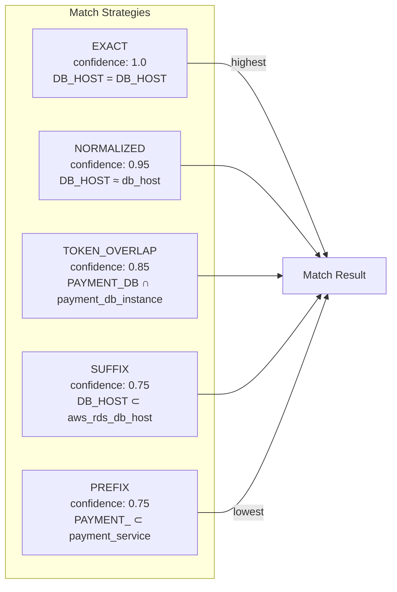

### Stitching Rules

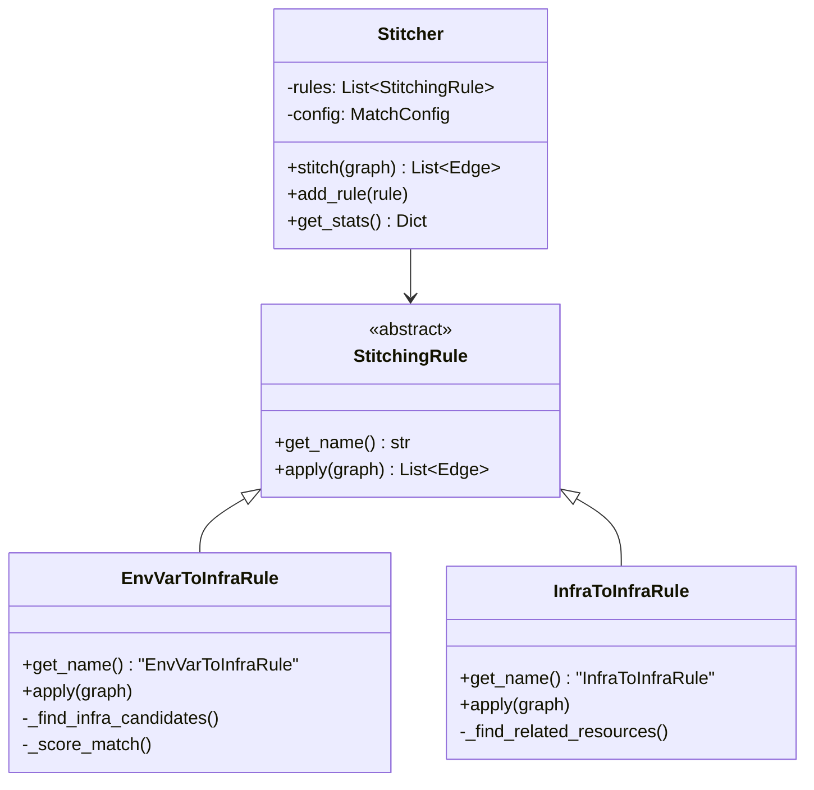

### Token Index for O(n) Matching

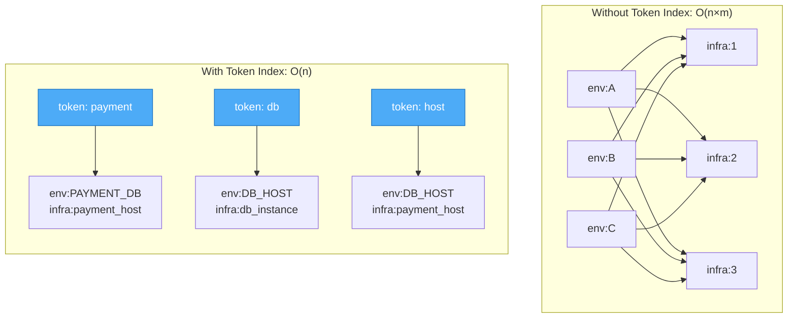

---

## Storage Layer

### Storage Architecture

```mermaid
graph TB
    subgraph Interface["Storage Interface"]
        BASE[StorageBackend<br/><<abstract>>]
    end
    
    subgraph Implementations["Implementations"]
        SQLITE[SQLiteStorage<br/>.jnkn/jnkn.db]
        MEMORY[MemoryStorage<br/>In-process]
    end
    
    BASE <|-- SQLITE
    BASE <|-- MEMORY
    
    subgraph "SQLite Schema"
        NODES_TABLE["nodes<br/>id, name, type, path,<br/>language, file_hash,<br/>tokens, metadata"]
        EDGES_TABLE["edges<br/>source_id, target_id,<br/>type, confidence,<br/>match_strategy, metadata"]
        FILES_TABLE["tracked_files<br/>path, hash, scanned_at"]
        META_TABLE["schema_meta<br/>version, created_at"]
    end
    
    SQLITE --> NODES_TABLE
    SQLITE --> EDGES_TABLE
    SQLITE --> FILES_TABLE
    SQLITE --> META_TABLE
```

### Database Schema

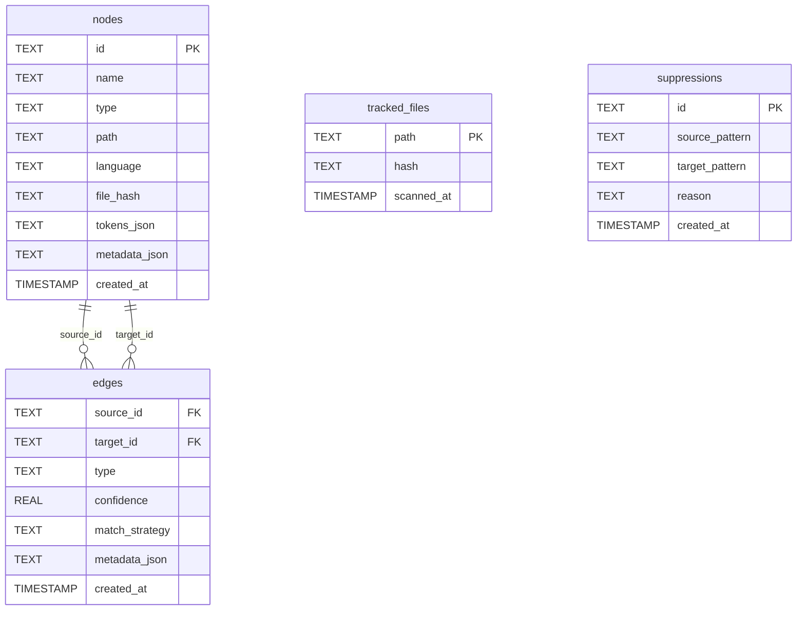

---

## Analysis Engine

### Blast Radius Algorithm

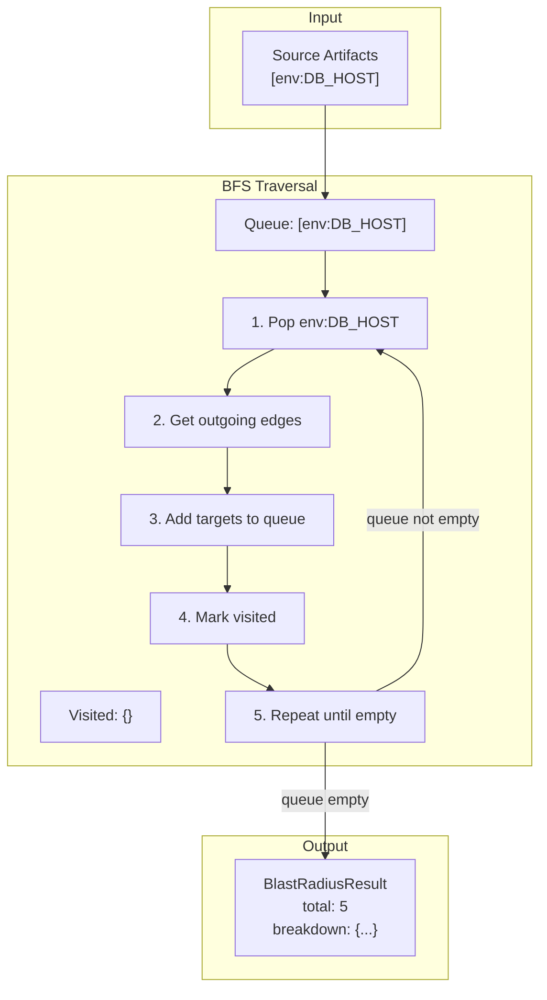

### Blast Radius Result Structure

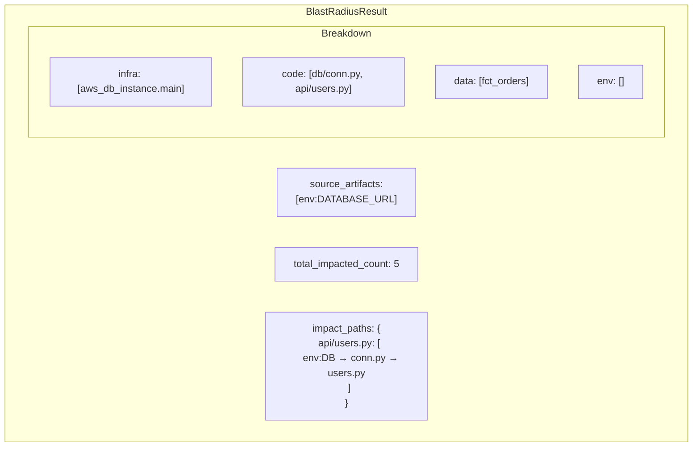

---

## CLI Layer

### Command Structure

```mermaid
graph TB
    subgraph "CLI Commands"
        MAIN["jnkn<br/>(main entry)"]
        
        SCAN["scan<br/>--dir, --db, --full,<br/>--min-confidence"]
        BLAST["blast-radius<br/>--db, --max-depth, --lazy"]
        STATS["stats<br/>--db"]
        CLEAR["clear<br/>--db, --force"]
        EXPLAIN["explain<br/>--source, --target"]
        SUPPRESS["suppress<br/>add/remove/list"]
    end
    
    MAIN --> SCAN
    MAIN --> BLAST
    MAIN --> STATS
    MAIN --> CLEAR
    MAIN --> EXPLAIN
    MAIN --> SUPPRESS
```

### CLI Flow

```mermaid
sequenceDiagram
    participant User
    participant Click as Click Framework
    participant Command as Command Handler
    participant Core as Core Modules
    participant Output as Rich Output
    
    User->>Click: jnkn scan --dir ./src
    Click->>Click: Parse arguments
    Click->>Command: scan(dir="./src", ...)
    
    Command->>Core: ParserEngine.scan()
    Core->>Core: Parse files
    Core->>Core: Build graph
    Core->>Core: Stitch domains
    Core-->>Command: ScanResult
    
    Command->>Output: Format results
    Output-->>User: ✅ Scan complete
```

---

## Extension Points

### Adding a New Parser

```mermaid
flowchart TB
    subgraph Steps["Steps to Add New Parser"]
        S1["1. Create parser class<br/>extends LanguageParser"]
        S2["2. Implement required methods<br/>name, extensions, parse()"]
        S3["3. Add tree-sitter queries<br/>(optional)"]
        S4["4. Register with engine"]
        S5["5. Add tests"]
    end
    
    S1 --> S2 --> S3 --> S4 --> S5
    
    subgraph Example["Example: GoParser"]
        CODE["class GoParser(LanguageParser):<br/>    name = 'go'<br/>    extensions = {'.go'}<br/>    <br/>    def parse(self, path, content):<br/>        yield from self._extract_imports()<br/>        yield from self._extract_env_vars()"]
    end
```

### Adding a New Stitching Rule

```mermaid
flowchart TB
    subgraph Steps["Steps to Add Stitching Rule"]
        S1["1. Create rule class<br/>extends StitchingRule"]
        S2["2. Implement get_name()"]
        S3["3. Implement apply(graph)"]
        S4["4. Register with Stitcher"]
        S5["5. Add tests"]
    end
    
    S1 --> S2 --> S3 --> S4 --> S5
    
    subgraph Example["Example: CodeToDataRule"]
        CODE["class CodeToDataRule(StitchingRule):<br/>    def get_name(self):<br/>        return 'CodeToDataRule'<br/>    <br/>    def apply(self, graph):<br/>        # Find code files that query data assets<br/>        ..."]
    end
```

---

## Directory Structure

```
jnkn/
├── src/jnkn/
│   ├── __init__.py
│   ├── cli.py                      # Legacy CLI entry
│   ├── models.py                   # Legacy models
│   │
│   ├── cli/                        # CLI Layer
│   │   ├── __init__.py
│   │   └── main.py                 # Click commands
│   │
│   ├── core/                       # Core Engine
│   │   ├── __init__.py
│   │   ├── types.py                # Node, Edge, enums
│   │   ├── graph.py                # DependencyGraph, TokenIndex
│   │   ├── stitching.py            # Stitcher, rules
│   │   ├── confidence.py           # Confidence scoring
│   │   └── storage/                # Storage backends
│   │       ├── __init__.py
│   │       ├── base.py             # StorageBackend ABC
│   │       ├── sqlite.py           # SQLite implementation
│   │       └── memory.py           # In-memory implementation
│   │
│   ├── parsing/                    # Parser System
│   │   ├── __init__.py
│   │   ├── base.py                 # LanguageParser ABC
│   │   ├── engine.py               # ParserEngine, Registry
│   │   │
│   │   ├── python/                 # Python Parser
│   │   │   ├── __init__.py
│   │   │   ├── parser.py
│   │   │   └── queries/
│   │   │       ├── imports.scm
│   │   │       └── definitions.scm
│   │   │
│   │   ├── terraform/              # Terraform Parser
│   │   │   ├── __init__.py
│   │   │   ├── parser.py
│   │   │   └── queries/
│   │   │       └── resources.scm
│   │   │
│   │   ├── kubernetes/             # Kubernetes Parser
│   │   │   ├── __init__.py
│   │   │   └── parser.py
│   │   │
│   │   ├── javascript/             # JavaScript/TypeScript Parser
│   │   │   ├── __init__.py
│   │   │   ├── parser.py
│   │   │   └── queries/
│   │   │       └── env_vars.scm
│   │   │
│   │   └── dbt/                    # dbt Parser
│   │       ├── __init__.py
│   │       └── manifest_parser.py
│   │
│   ├── analysis/                   # Analysis Engine
│   │   ├── __init__.py
│   │   ├── blast_radius.py         # Impact calculation
│   │   └── explain.py              # Match explanation
│   │
│   └── stitching/                  # Stitching Utilities
│       ├── __init__.py
│       ├── matchers.py             # Token matching
│       └── suppressions.py         # False positive suppression
│
├── tests/
│   ├── unit/
│   │   ├── core/
│   │   ├── parsing/
│   │   ├── analysis/
│   │   └── stitching/
│   └── e2e_live/
│
├── scripts/
│   ├── verify_parsers.py           # Parser verification
│   └── verify_e2e.sh               # E2E verification
│
├── pyproject.toml
├── README.md
└── ARCHITECTURE.md                 # This file
```

---

## Performance Considerations

### Token Index Optimization

The TokenIndex enables O(n) stitching instead of O(n×m):

```mermaid
graph LR
    subgraph "Naive Approach"
        N1["100 env vars"] --> |"× 500 infra"| N2["50,000 comparisons"]
    end
    
    subgraph "Token Index"
        T1["100 env vars"] --> |"index by token"| T2["~600 lookups"]
    end
    
    N2 --> |"~80x slower"| SLOW[❌]
    T2 --> |"~80x faster"| FAST[✅]
    
    style FAST fill:#40c057,stroke:#2f9e44,color:#fff
    style SLOW fill:#ff6b6b,stroke:#c92a2a,color:#fff
```

### Incremental Scanning

File hashes enable incremental scans:

```mermaid
flowchart LR
    FILE["app.py"] --> HASH["xxhash"]
    HASH --> CHECK{"Hash<br/>changed?"}
    CHECK --> |Yes| PARSE["Parse file"]
    CHECK --> |No| SKIP["Skip file"]
    PARSE --> UPDATE["Update DB"]
    
    style SKIP fill:#40c057,stroke:#2f9e44,color:#fff
```

---

## Future Roadmap

```mermaid
timeline
    title jnkn Roadmap
    
    section Epic 1 - Foundation
        Core Types : Node, Edge models
        Graph Engine : DependencyGraph
        Basic CLI : scan, blast-radius
    
    section Epic 2 - Parser Expansion
        Python Parser : env vars, imports
        Terraform Parser : resources, variables
        Kubernetes Parser : deployments, env vars
        JavaScript Parser : process.env
        dbt Parser : manifest lineage
    
    section Epic 3 - Intelligence
        Semantic Matching : LLM-assisted stitching
        Change Detection : Git diff integration
        Risk Scoring : Impact severity
    
    section Epic 4 - Integration
        GitHub Action : PR comments
        CI/CD Gates : Block risky deploys
        IDE Extension : VSCode plugin
```

---

## References

- [README.md](./README.md) - User documentation
- [pyproject.toml](./pyproject.toml) - Project configuration
- [Tree-sitter](https://tree-sitter.github.io/) - Parser framework
- [NetworkX](https://networkx.org/) - Graph algorithms
- [Pydantic](https://docs.pydantic.dev/) - Data validation