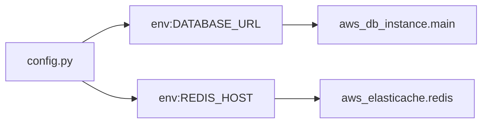

# Dependency Graph

The core data structure of Jnkn.

## What Is It?

A dependency graph is a directed graph where:

- **Nodes** are artifacts (files, env vars, infrastructure)
- **Edges** are dependencies between artifacts



## Nodes

Each node represents an artifact in your system:

```json
{
  "id": "env:DATABASE_URL",
  "name": "DATABASE_URL",
  "type": "env_var",
  "metadata": {
    "source": "os.getenv",
    "file": "src/config.py",
    "line": 10
  }
}
```

### Node Types

| Type | Represents | Example ID |
|------|------------|------------|
| `code_file` | Source file | `file://src/app.py` |
| `code_entity` | Function/class | `entity:src/app.py:main` |
| `env_var` | Environment variable | `env:DATABASE_URL` |
| `infra_resource` | Terraform resource | `infra:aws_rds.main` |
| `k8s_resource` | Kubernetes resource | `k8s:default/deployment/api` |
| `data_asset` | dbt model | `data:fct_orders` |

## Edges

Edges represent dependencies:

```json
{
  "source": "file://src/config.py",
  "target": "env:DATABASE_URL",
  "type": "reads",
  "metadata": {
    "pattern": "os.getenv",
    "line": 10
  }
}
```

### Edge Types

| Type | Meaning | Example |
|------|---------|---------|
| `reads` | Source reads from target | File reads env var |
| `imports` | Source imports target | Python import |
| `provides` | Source provides target | Terraform outputs value |
| `configures` | Source configures target | K8s uses ServiceAccount |
| `contains` | Source contains target | File contains function |
| `references` | Generic reference | Cross-domain link |

## Graph Properties

**Directed** — Edges have direction. `A → B` means "A depends on B."

**Mostly Acyclic** — Well-designed systems don't have circular dependencies.

**Multi-Domain** — Nodes span different technology domains (Python, Terraform, K8s).

## Querying the Graph

### Find Dependencies

"What does X depend on?"

```bash
jnkn blast env:DATABASE_URL
```

### View Statistics

```bash
jnkn stats
```

## Storage

The graph is stored in SQLite at `.jnkn/jnkn.db`.

## Why a Graph?

Graphs enable:

1. **Traversal** — Follow dependencies to any depth
2. **Visualization** — See system structure  
3. **Algorithms** — Shortest path, cycle detection
4. **Incremental updates** — Add/remove nodes efficiently
